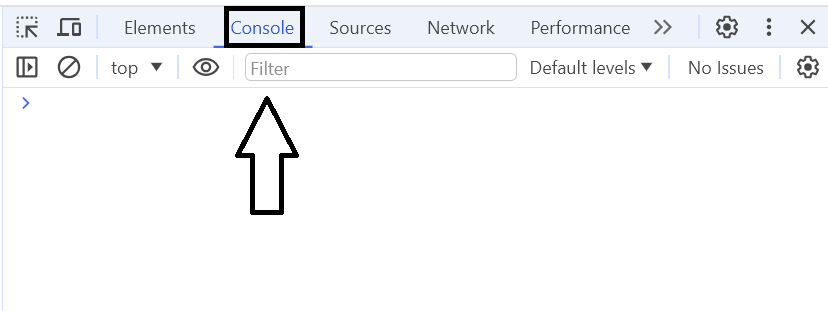

# Javascript Variables and Datatypes

## Description 📄
Time to practice creating and using javascript variables and working with different datatypes. We will primarily be interacting with the console in the dev tools via the browser.

Note: All work in this lab will be done in the `script.js` file. The HTML exists only to link the Javascript file so we can use the browser console. 

## ToDo list ✅
**Attention**: When you complete a task, put an `x` in the middle of the brackets to mark it off your ToDo list.

[ ] Open the browser console and navigate to the console. It should look like this:

[ ] Type `console.log('Start')` into the `script.js` file. Go back to the browser and refresh the page (cmd/ctrl r). You should see:

Congrats! You've just written your first Javascript code. As we can see the browser console can be used to display information. We can write our Javascript code in `script.js` and it will execute when we refresh the browser.

[ ] Now write `console.log('hello')`. Refresh the page and you should see the word hello underneath start. Javascript files execute top to bottom.

So far everything we have been logging to the console is of the `string` datatype. Remember that strings are a sequence of characters representing letters and words. In Javascript we use single quotes `''` or double quotes for strings `""`. Functionally there is no difference between them.

[ ] Now try to log out the word `animal` but omit the quotes, `console.log(animal)`. Refresh the page. What happened? You got a `referenceError` in that the variable `animal` is not defined. The quotes are important in distinguishing between a value and a variable in this case. Add quotes around the word `animal` and refresh.

[ ] Time to create some variables and give them values. Type the below in and refresh the page. You should see the word dog in the browser console.

[ ] Try creating some more on your own to describe yourself. This one is more open ended to let you get some practice writing variables and using different datatypes. Some common examples: name, age, location, occupation, etc

---

### Solution codebase 👀
🛑 **Only use this as a reference** 🛑

💾 **Not something to copy and paste** 💾

**Note:**  This lab references a solution file located [here](https://github.com/HackerUSA-CE/saai-ic-d6-variables/tree/solution).
